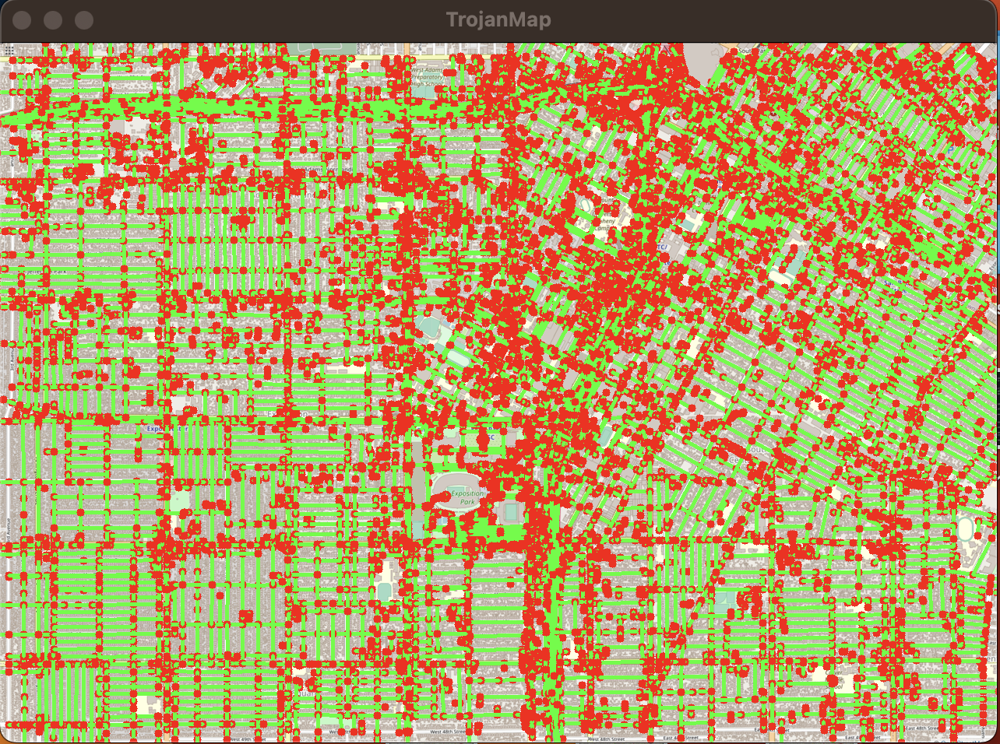
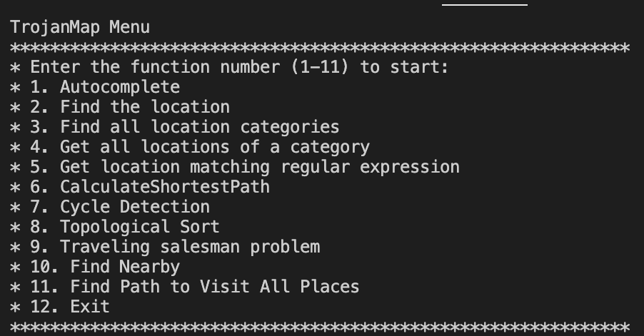

# EE538: Computing Principles for Electrical Engineers - Project: Trojan Map

## Final Report by: Ashish Kumar and Sunanda Somu

## Video: https://www.youtube.com/watch?v=XgosrAJvLP8

### The project requires to create a graph and perform mapping computations out of ~20000 coordinates located around the area of University of Southern California. Run various algorithms on it like

- Autocomplete
- Find Location
- Find Closest Name & Calculate Edit Distance
- Get all categories
- Get all locations of category 
- Get location matching regular expression 
- Calculate Shortest Path
- Cycle Detection                                          
- Topological Sort
- Traveling salesman problem 
  - Brute Force Algorithm
  - BackTracking Algorithm
  - 2-opt Algorithm
  - 3-opt Algorithm
- Find Nearby 
- All nodes Shortest Path
- Dynamic Map UI 

<p align="center"></p>

## The Data Structure

Each point on the map is represented by the class **Node** defined in [trojanmap.h] as below

```cpp
class Node {
public:
  Node(){};
  Node(const Node &n) {
    id = n.id;
    lat = n.lat;
    lon = n.lon;
    name = n.name;
    neighbors = n.neighbors;
    attributes = n.attributes;
  };
  std::string id;    // A unique id assign to each point
  double lat;        // Latitude
  double lon;        // Longitude
  std::string name;  // Name of the location. E.g. "Bank of America".
  std::vector<std::string>
      neighbors;  // List of the ids of all neighbor points.
  std::unordered_set<std::string>
      attributes;  // List of the attributes of the location.

};
```

## Menu
We have implemented Menu as the Static and Dynamic UI
Here is the image for Static UI
<p align="center"></p>
Here is the image for Dynamic UI
<p align="center"></p>

## 1. Autocomplete The Location Name
```cpp
std::vector<std::string> Autocomplete(std::string name);
```
Here, the input is entered as a string and is transformed into lower case letters to avoid case sensitivity. After this, an autocomplete suggestion using entered input as prefix is displayed on the screen. If input is an empty string, an empty string is returned as output. 
### The runtime of the function: O(n)

Example:

Input: "Chi"

Output: ["Chick-fil-A", "Chipotle", "Chinese Street Food"]


## 2.1 Find the place's coordinates in the Map
```cpp
std::pair<double, double> GetPosition(std::string name);
```
In this function, we check through the data vector and find out the exact matching name; if we find a match, longitude and latitude values are displayed as output. If the entered name does not match, then it suggests a list of locations, and outputs the values of longitude and latitude of the chosen location. If in case an empty string is entered the function returns -1 for both longitude and latitude.

### Time complexity is O(n)
 
Example:

Input: "Target"

Output: (34.0257016, -118.2843512) 


## 2.2. Check Edit Distance Between Two Location Names
```cpp
int CalculateEditDistance(std::string name1, std::string name2);
```
Here in CalculateEditDistance, we use distance algorithm to calculate the distance between two strings. We use 2D vector for tabulization and dynamic programming. Condition in this is that if any string is an empty string, then the other string is returned as output. Using a loop, we compare both strings, if the characters are different then we take a minimum of three operations: insert, delete or replace a character.
If the entered string does not match with the data vector then using FindClosetName function, we see a Did you mean suggestion with most closest option.

### Time complexity is O(n)

Example:

Input: "Rolphs", "Ralphs"

Output: 1

## 3. Get All Categories
```cpp
std::vector<std::string> GetAllCategories();
```
This function returns all the available categories of location in the map.
### Time complexity is O(n)

## 4. Get All Locations In A Category
```cpp
std::vector<std::string> GetAllLocationsFromCategory(std::string category);
```
This function helps to return values as locations in an input category.

### Time complexity is O(n)

Example:

Input: bank

Output: 9591449441, 9591449465, 5237417651.

## 5. Get Locations Using A Regular Expression
```cpp
std::vector<std::string> GetLocationRegex(std::regex location);
```
Under this function, an input of regular expression for the category is entered and based on that the location ids are returned as output. This also verifies if input regular expression is correct or not. If it is verified as incorrect or if the regex is invalid, then an empty vector is returned.

### Time complexity is O(n)

Example:

Input: 37th.*

Output: 1614922613, 5555212953, 6206425701, 9587039891, 9587039892, 9587039893.

## 6. CalculateShortestPath between two places
```cpp
std::vector<std::string> CalculateShortestPath_Dijkstra(std::string &location1_name,
                                               std::string &location2_name);
std::vector<std::string> CalculateShortestPath_Bellman_Ford(std::string &location1_name,
                                               std::string &location2_name);
```
The main purpose of this function is to find the shortest path and distance between the two locations.

Dijkstra: It works on a greedy approach. We firstly initialize the distance as infinity from source to each node. Then using unordered map we keep track of all the previous nodes in order to build the entire shortest path. We use a min heap to track the shortest path. Iteration is done through neighbors on top of heap and if the sum of distance of edge and node is less than neighbors we had before, we push to the heap and the same is followed till the heap is empty. This cannot handle negative cycles.
### Time complexity is O(Edges*log(vertices))

Bellman_Ford: We use an iterative approach and a map to save distance from source to node. We initialize the distance to infinity from source to every node. We use an extra intermediate edge every time and update distance with shortest distance. This can handle negative cycles.
### Time complexity is O(Edges*Vertices)


| Source to Destination | Dijkstra Algorithm | Bellman Ford Algorithm |
| ----------------------|:------------------:|-----------------------:|
| Chipotle to Parking Center| 97ms | 14358ms |
| Chase to City Tacos | 86ms | 16086ms |
| Lululemon to USC Roski Eye Institute | 78ms | 14372ms |
| Olive & 12th to Insomnia Cookies | 215ms | 19590ms |
| Village Cobbler to Credit Union | 74ms | 14869ms |
| Chipotle to Chase | 80ms | 13654 ms |
| Lululemon to Insomnia Cookie | 4 ms | 195 ms |
| Ralphs to KFC | 148 ms | 15200 ms |
| Ralphs to Target | 110 ms | 15176 ms |
| Target to Chase | 91 ms | 14296 ms |
| Target to Chipotle | 112 ms | 14148 ms |
| Crosswalk to Ralphs | 81 ms | 14180 ms |
| Crosswalk to Target | 81 ms | 13654 ms |
| Crosswalk to Chase | 116 ms | 13640 ms |
| Crosswalk to Chipotle | 147 ms | 15321 ms |

## 7. Cycle Detection
```cpp
bool CycleDetection(std::vector<double> &square);
```
In this function, we run DFS on a graph starting from every node, and when we hit a visited node that is where we find a back edge.  A subgraph is created inside the main Trojan Map using the left, right, upper, lower coordinates.Then these are transversed while keeping a track of visited nodes. If it is revisited, cycle exists.If no, then no cycle exists.

### Time complexity is observed to be O(N)

Example 1:

Input: square = {-118.299, -118.264, 34.032, 34.011}

Output: true

Example 2:

Input: square = {-118.290, -118.289, 34.030, 34.020}

Output: false


## 8. Topological Sort

```cpp
std::vector<std::string> DeliveringTrojan(std::vector<std::string> &location_names,std::vector<std::vector<std::string>> &dependencies);
```
The main purpose is to return the best route to be taken when we have inputs and dependencies. Here we use an adjacency list with the dependencies to get a path. We run DFS here.
### Time complexity is O(Nodes+Edges)

Example:

Input:
location_names = {"Ralphs", "Chick-fil-A", "KFC"}. dependencies = {{"Ralphs","KFC"}, {"Ralphs","Chick-fil-A"}, {"Chick-fil-A", "KFC"}}

Output: Ralphs->Chick-fil-A->KFC

## 9. The Traveling Trojan Problem (AKA Traveling Salesman!)

The main purpose of this is to return the shortest path between N locations when each location is visited only once.

- Brute Force Algorithm:
  Consider a start node as 1st location, Generate all (n-1)! paths permutations of the locations and calculate the cost of every permutation, keep track of minimum cost for the path. Return the path with minimum cost.

### Time Complexity: O(N!)

- BackTracking Algorithm: 
Consider node 0 as the starting and ending point. Start traversing from the source to its adjacent nodes in DFS manner and calculate the cost of every step and minimum cost as well. Return the permutation with minimum cost.

### Time Complexity: O(N!)

- 2-opt Algorithm:

Take 2 edges from the route, reconnect these edges with each other and calculate new travel distance. If this modification has led to a shorter total travel distance the current, route is updated. The algorithm continues to build on the improved route and repeats the steps. This process is repeated until no more improvements are found or until a pre-specified number of iterations is completed.

### Time Complexity: O(N^2)

- 3-opt Algorithm:
Take 3 edges from the route, reconnect these edges with each other and calculate new travel distance. If this modification has led to a shorter total travel distance the current route is updated. The algorithm continues to build on the improved route and repeats the steps. This process is repeated until no more improvements are found or until pre-specified number of iterations is complete. 3-opt analysis involves deleting 3 connections (or edges) in a network (or tour), to create 3 sub-tours. Then the 7 different ways of reconnecting the network are analysed to find the optimum one. This process is then repeated for a different set of 3 connections, until all possible combinations have been tried in a network.

### Time Complexity: O(N^3)


