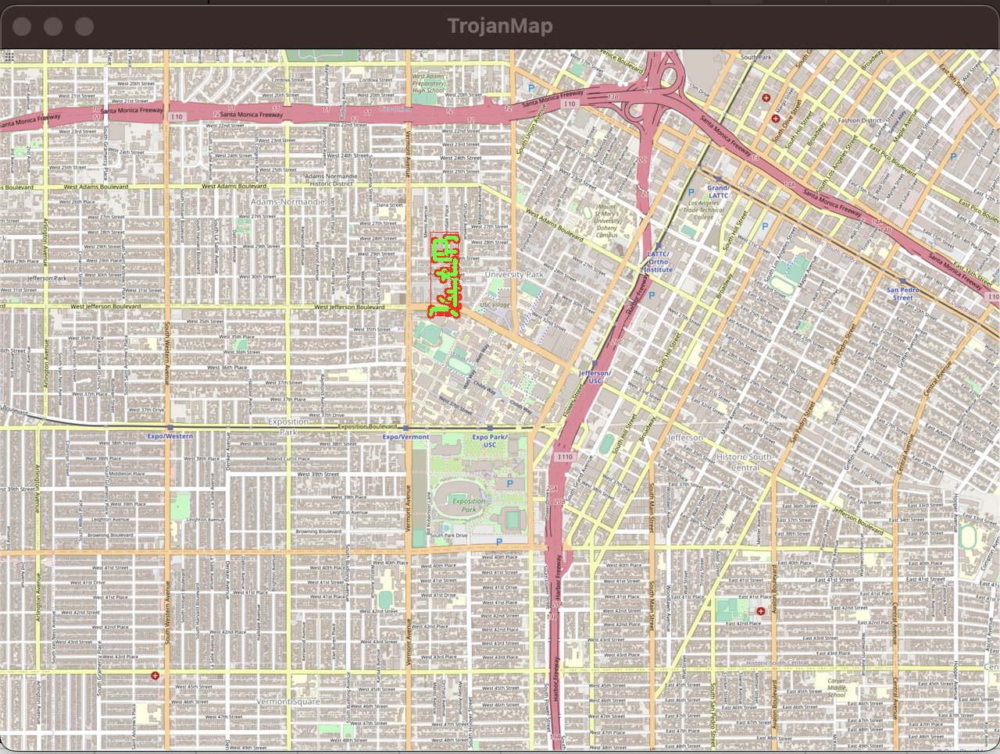

# EE538: Computing Principles for Electrical Engineers - Project: Trojan Map

## Final Report by: Ashish Kumar and Sunanda Somu

## Video: https://www.youtube.com/watch?v=XgosrAJvLP8

### The project requires to create a graph and perform mapping computations out of ~20000 coordinates located around the area of University of Southern California. Run various algorithms on it like

- Autocomplete
- Find Location
- Find Closest Name & Calculate Edit Distance
- Get all categories
- Get all locations of category 
- Get location matching regular expression 
- Calculate Shortest Path
- Cycle Detection                                          
- Topological Sort
- Traveling salesman problem 
  - Brute Force Algorithm
  - BackTracking Algorithm
  - 2-opt Algorithm
  - 3-opt Algorithm
- Find Nearby 
- All nodes Shortest Path
- Dynamic Map UI 

<p align="center"></p>

## The Data Structure

Each point on the map is represented by the class **Node** defined in [trojanmap.h] as below

```cpp
class Node {
public:
  Node(){};
  Node(const Node &n) {
    id = n.id;
    lat = n.lat;
    lon = n.lon;
    name = n.name;
    neighbors = n.neighbors;
    attributes = n.attributes;
  };
  std::string id;    // A unique id assign to each point
  double lat;        // Latitude
  double lon;        // Longitude
  std::string name;  // Name of the location. E.g. "Bank of America".
  std::vector<std::string>
      neighbors;  // List of the ids of all neighbor points.
  std::unordered_set<std::string>
      attributes;  // List of the attributes of the location.

};
```

## Menu
We have implemented Menu as the Static and Dynamic UI
Here is the image for Static UI
<p align="center"></p>
Here is the image for Dynamic UI
<p align="center"></p>

## 1. Autocomplete The Location Name
```cpp
std::vector<std::string> Autocomplete(std::string name);
```
Based on a partial string, the program returns possible locations from our data.csv file, which have the same prefix. The partial name given can be case-insensitive.
### The runtime of the function: O(n)

Example:

Input: "Chi"

Output: ["Chick-fil-A", "Chipotle", "Chinese Street Food"]

<p align="center"></p>

## 2.1 Find the place's coordinates in the Map
```cpp
std::pair<double, double> GetPosition(std::string name);
```
For the given input string we find out the exact matching name, in our data.csv file if a match is found, longitude and latitude values are displayed. If the entered name does not match, then it matches to the nearest prefix using edit distance function.

### Time complexity is O(n)
 
Example:

Input: "Target"

Output: (34.0257016, -118.2843512) 

<p align="center"></p>

<p align="center"></p>
## 2.2. Check Edit Distance Between Two Location Names
```cpp
int CalculateEditDistance(std::string name1, std::string name2);
```
For the given strings we create a matrix and do dynamic programming to check if the substring are same or not and if it needs any 3 operations: insert, delete or replace a character. If the entered string does not match with the data vector then using FindClosetName function, we see a Did you mean suggestion with most closest option.

### Time complexity is O(n)

Example:

Input: "Rolphs", "Ralphs"

Output: 1

<p align="center"></p>

## 3. Get All Categories
```cpp
std::vector<std::string> GetAllCategories();
```
For this function, we pass over the dataset and check if there is an item preset in the attributes column, if the attribute is found then return the list of all the categories.
### Time complexity is O(n)

<p align="center"></p>

## 4. Get All Locations In A Category
```cpp
std::vector<std::string> GetAllLocationsFromCategory(std::string category);
```
For a given string, check if it matches the element in attribute column, if it does then return list of all the IDs.

### Time complexity is O(n)

Example:

Input: bank

Output: 9591449441, 9591449465, 5237417651.

<p align="center"></p>
<p align="center"></p>

## 5. Get Locations Using A Regular Expression
```cpp
std::vector<std::string> GetLocationRegex(std::regex location);
```
For a regular expression as an input, first check if it is a regular expression or not. Then for the entered category check if the attributes column of each row matches the regular expression if it does then add it to the list and return the final id list.

### Time complexity is O(n)

Example:

Input: 37th.*

Output: 1614922613, 5555212953, 6206425701, 9587039891, 9587039892, 9587039893.

<p align="center"></p>
<p align="center"></p>

## 6. CalculateShortestPath between two places
```cpp
std::vector<std::string> CalculateShortestPath_Dijkstra(std::string &location1_name,
                                               std::string &location2_name);
std::vector<std::string> CalculateShortestPath_Bellman_Ford(std::string &location1_name,
                                               std::string &location2_name);
```
The purpose of this function is to find the shortest path and distance between the two locations.

Dijkstra: It works on a greedy approach. We firstly initialize the distance as infinity from source to each node. Then using unordered map we keep track of all the previous nodes in order to build the entire shortest path. We use a min heap to track the shortest path. Iteration is done through neighbors on top of heap and if the sum of distance of edge and node is less than neighbors we had before, we push to the heap and the same is followed till the heap is empty. This cannot handle negative cycles.
### Time complexity is O(Edges*log(vertices))

Bellman_Ford: We use an iterative approach and a map to save distance from source to node. We initialize the distance to infinity from source to every node. We use an extra intermediate edge every time and update distance with shortest distance. This can handle negative cycles.
### Time complexity is O(Edges*Vertices)


| Source to Destination | Dijkstra Algorithm | Bellman Ford Algorithm |
| ----------------------|:------------------:|-----------------------:|
| Chipotle to Parking Center| 97ms | 14358ms |
| Chase to City Tacos | 86ms | 16086ms |
| Lululemon to USC Roski Eye Institute | 78ms | 14372ms |
| Olive & 12th to Insomnia Cookies | 215ms | 19590ms |
| Village Cobbler to Credit Union | 74ms | 14869ms |
| Chipotle to Chase | 80ms | 13654 ms |
| Lululemon to Insomnia Cookie | 4 ms | 195 ms |
| Ralphs to KFC | 148 ms | 15200 ms |
| Ralphs to Target | 110 ms | 15176 ms |
| Target to Chase | 91 ms | 14296 ms |
| Target to Chipotle | 112 ms | 14148 ms |
| Crosswalk to Ralphs | 81 ms | 14180 ms |
| Crosswalk to Target | 81 ms | 13654 ms |
| Crosswalk to Chase | 116 ms | 13640 ms |
| Crosswalk to Chipotle | 147 ms | 15321 ms |

<p align="center"></p>
<p align="center"></p>

## 7. Cycle Detection
```cpp
bool CycleDetection(std::vector<double> &square);
```
In this function, we run DFS on a graph starting from every node, and when we hit a visited node that is where we find a back edge. A subgraph is created inside the main Trojan Map using the left, right, upper, lower coordinates.Then these are transversed while keeping a track of visited nodes. If it is revisited, cycle exists. If no, then no cycle exists.

### Time complexity is observed to be O(N)

Example 1:

Input: square = {-118.299, -118.264, 34.032, 34.011}

Output: true

Example 2:

Input: square = {-118.290, -118.289, 34.030, 34.020}

Output: false
| Input Square Coordinates | Cycle exist | Runtime |
| ----------------------|:------------------:|-----------------------:|
| -118.299, -118.264, 34.032, 34.011 | Yes | 4 ms |
| -118.290, -118.289, 34.030, 34.020 | No | 0 ms |
| -118.290, -118.288, 34.030, 34.025 | Yes | 0 ms |
| -118.99, -118.264, 34.020, 34.011 | Yes | 2 ms |
| -118.296, -118.286, 34.035, 34.011 | Yes | 2 ms |
| -118.295, -118.287, 34.035, 34.011 | Yes | 1 ms |
| -118.296, -118.286, 34.036, 34.012 | Yes | 2 ms |
| -118.296, -118.286, 34.036, 34.011 | Yes | 2 ms |

<p align="center"></p>
<p align="center"></p>
<p align="center"></p>
<p align="center"></p>
## 8. Topological Sort

```cpp
std::vector<std::string> DeliveringTrojan(std::vector<std::string> &location_names,std::vector<std::vector<std::string>> &dependencies);
```
The main purpose is to return the best route to be taken when we have inputs and dependencies. Here we use an adjacency list with the dependencies to get a path. We run DFS here.
### Time complexity is O(Nodes+Edges)

Example:

Input:
location_names = {"Ralphs", "Chick-fil-A", "KFC"}. dependencies = {{"Ralphs","KFC"}, {"Ralphs","Chick-fil-A"}, {"Chick-fil-A", "KFC"}}

Output: Ralphs->Chick-fil-A->KFC

| Input Locations | Topologically Sorted Output |
| ----------------------|------------------:|
| Cardinal gardens, Coffee Bean1, CVS | Cardinal gardens Coffee Bean1 CVS |
| Ralphs, Chick-fil-A, KFC | Ralphs KFC Chick-fil-A |
| Target KFC Chick-fil-A | Target Chick-fil-A KFC |
| Ralphs Target KFC Chick-fil-A | Ralphs Target Chick-fil-A KFC |
| Ralphs Target KFC Chase | Ralphs Target Chase KFC |
| Ralphs KFC Chase Chick-fil-A | Chick-fil-A Ralphs Chase KFC |
| Ralphs Target Chase Chick-fil-A | Chick-fil-A Ralphs  Target Chase Target |
| Ralphs Target Chase Crosswalk | Crosswalk Target Chase Target |

<p align="center"></p>
<p align="center"></p>

## 9. The Traveling Trojan Problem (AKA Traveling Salesman!)

The main purpose of this is to return the shortest path between N locations when each location is visited only once.

- ## Brute Force Algorithm:
  Consider a start node as 1st location, Generate all (n-1)! paths permutations of the locations and calculate the cost of every permutation, keep track of minimum cost for the path. Return the path with minimum cost.

  ### Time Complexity: O(N!)

- ## BackTracking Algorithm: 
  Consider node 0 as the starting and ending point. Start traversing from the source to its adjacent nodes in DFS manner and calculate the cost of every step and minimum cost as well. Return the permutation with minimum cost.

  ### Time Complexity: O(N!)

- ## 2-opt Algorithm:

  Take 2 edges from the route, reconnect these edges with each other and calculate new travel distance. If this modification has led to a shorter total travel distance the current, route is updated. The algorithm continues to build on the improved route and repeats the steps. This process is repeated until no more improvements are found or until a pre-specified number of iterations is completed.

  ### Time Complexity: O(N^2)

- ## 3-opt Algorithm:
  Take 3 edges from the route, reconnect these edges with each other and calculate new travel distance. If this modification has led to a shorter total travel distance the current route is updated. The algorithm continues to build on the improved route and repeats the steps. This process is repeated until no more improvements are found or until pre-specified number of iterations is complete. 3-opt analysis involves deleting 3 connections (or edges) in a network (or tour), to create 3 sub-tours. Then the 7 different ways of reconnecting the network are analysed to find the optimum one. This process is then repeated for a different set of 3 connections, until all possible combinations have been tried in a network.

  ### Time Complexity: O(N^3)
  
  
| Number of Nodes | Brute Force Runtime | Backtracking Runtime | 2-opt Runtime | 3-opt Runtime |
| ----------------------|:------------------:|:-----------------------:|:-----------------------:|-----------------------:|
| 5 | 0 ms | 0 ms | 0ms | 151 ms |
| 6 | 1 ms | 2 ms | 0 ms | 690 ms |
| 7 | 17 ms | 12 ms | 0 ms | 1183 ms |
| 8 | 96 ms | 52 ms | 1 ms | 2050 ms |
| 9 | 857 ms | 906 ms | 2 ms | 3124 ms |

<p align="center"></p>
  

## 10. Find Nearby 

```cpp
std::vector<std::string> TrojanMap::FindNearby(std::string attributesName, std::string name, double r, int k);
```
It returns k locations that are part of the input category within the radius of r of given input location. In this case, the inputs that are present are checked within the data points, if a data point with the same attribute has distance to the input location less than radius r. We save it in a heap, then return it using the heap.

### Time complexity is O(Nodes^2)

Example: 

Input: Attribute - bank Locations- Ralphs Radius - 6 Number k - 4
Output: Attributes - 1.Chase 2.Bank of America 3.USC Credit Union Time - 10ms

| Input Data | Output Data | Runtime |
| ----------------------|:------------------:|-----------------------:|
| attribute:bank locations:Ralphs radius r:6 number k:4 | 1.Chase 2.Bank of America 3.USC Credit Union | 10ms |
| attribute:library locations:Village Cobbler radius r:5 number k:6 | 1.Leavey Library 2.Junipero Serra Branch Los Angeles Public Library 3.Junipero Serra Library 4.Jefferson Branch Los Angeles Public Library 5.Vernon Branch Los Angeles Public Library | 9ms |
| attribute:bank locations:Ralphs radius r:6 number k:4 | 1.USC Credit Union 2.Bank of America 3.Chase | 7 ms |
| attribute:bank locations:Chase radius r:5 number k:3 | 1.Bank of America 2.USC Credit Union | 7 ms |
| attribute:library locations:Ralphs input radius r:2 number k:10 | 1.Leavey Library 2.Jefferson Branch Los Angeles Public Library 3.Junipero Serra Branch Los Angeles Public Library | 7 ms |

<p align="center"></p>
<p align="center"></p>

## 11. Find the Shortest Path to Visit All locations

```cpp
std::vector<std::string> TrojanMap::TrojanPath(std::vector<std::string> &location_names)
```
First Initialize the solution matrix same as the input graph matrix as a first step. Then update the solution matrix by considering all vertices as an intermediate vertex. The idea is to one by one pick all vertices and updates all shortest paths which include the picked vertex as an intermediate vertex in the shortest path. When we pick vertex number k as an intermediate vertex, we already have considered vertices {0, 1, 2, .. k-1} as intermediate vertices. For every pair (i, j) of the source and destination vertices respectively, there are two possible cases. k is not an intermediate vertex in shortest path from i to j. We keep the value of dist[i][j] as it is. k is an intermediate vertex in shortest path from i to j. We update the value of dist[i][j] as dist[i][k] + dist[k][j] if dist[i][j] > dist[i][k] + dist[k][j]

### Time complexity is O(Nodes^2)

Example:

Input:
Jefferson Park, Chase, Crosswalk

Output:
The distance of the path is:2.87257 miles
Time taken by function: 665 ms
| Input Locations | Path Length | Time |
| ----------------------|:------------------:|-----------------------:|
| Jefferson Park Chase Crosswalk | 2.87257 miles | 665 ms |
| Jefferson Park Chick-fil-A Crosswalk | 3.21827 miles | 738 ms |
| Ralphs KFC Target Chase | 1.706 miles | 814 ms |
| Ralphs KFC Target | 1.468196 miles | 481 ms |
| Ralphs Target Crosswalk | 0.969489 miles | 419 ms |
| Ralphs KFC Crosswalk | 1.13875 miles | 480 ms |
| Ralphs Chick-fil-A Crosswalk | 1.68623 miles | 654 ms |
| KFC Chick-fil-A Crosswalk | 1.38978 miles | 614 ms |
| Target Chick-fil-A Crosswalk | 1.21733 miles | 589 ms |

<p align="center"></p>


## Conclusions and Lessons Learnt

We learnt 
- Data Structures
  - Graphs
  - Priority Queues
  - Maps
  - Hash Tables 
- Algorithms 
  - DFS
  - Dijkstra
  - Bellman Ford
  - Backtracking
  - 2opt
  - 3opt

- Dynamic Programming

- Analyse Time Complexities

- Git


